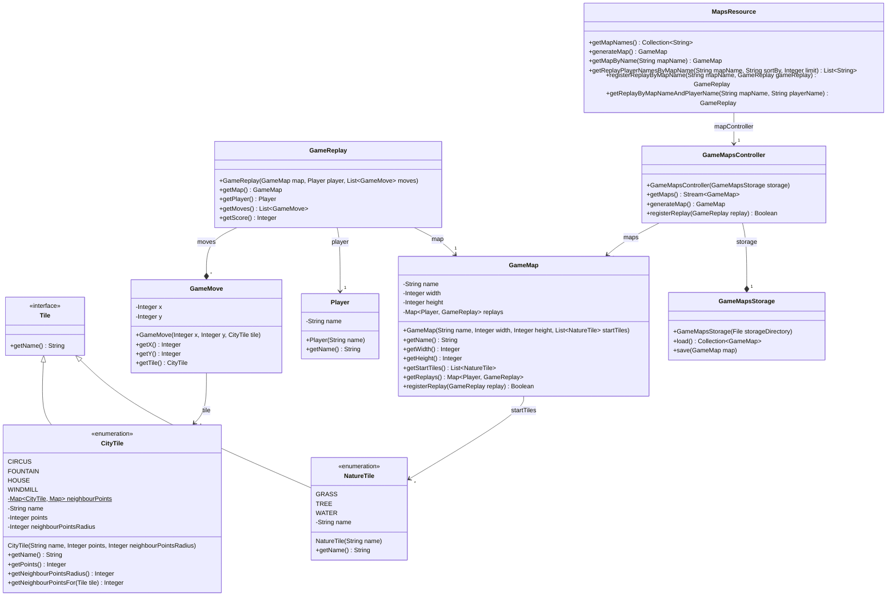

# Backend class diagram

```mermaid
classDiagram
class Tile {
    <<interface>>
    +getName() String
}

Tile <|-- NatureTile
class NatureTile {
    <<enumeration>>
    GRASS
    TREE
    WATER
    -String name
    NatureTile(String name)
    +getName() String
}

Tile <|-- CityTile
class CityTile {
    <<enumeration>>
    CIRCUS
    FOUNTAIN
    HOUSE
    WINDMILL
    -Map~CityTile, Map<Tile, Integer>~ neighbourPoints$
    -String name
    -Integer points
    -Integer neighbourPointsRadius
    CityTile(String name, Integer points, Integer neighbourPointsRadius)
    +getName() String
    +getPoints() Integer
    +getNeighbourPointsRadius() Integer
    +getNeighbourPointsFor(Tile tile) Integer
}

class Player {
    -String name
    +Player(String name)
    +getName() String
}

class GameMap {
    -String name
    -Integer width
    -Integer height
    -Map~Player, GameReplay~ replays
    +GameMap(String name, Integer width, Integer height, List~NatureTile~ startTiles)
    +getName() String
    +getWidth() Integer
    +getHeight() Integer
    +getStartTiles() List~NatureTile~
    +getReplays() Map~Player, GameReplay~
    +registerReplay(GameReplay replay) Boolean
}
GameMap --> "*" NatureTile: startTiles

class GameReplay {
    +GameReplay(GameMap map, Player player, List~GameMove~ moves)
    +getMap() GameMap
    +getPlayer() Player
    +getMoves() List~GameMove~
    +getScore() Integer
}
GameReplay --> "1" GameMap: map
GameReplay --> "1" Player: player
GameReplay --* "*" GameMove: moves

class GameMove {
    -Integer x
    -Integer y
    +GameMove(Integer x, Integer y, CityTile tile)
    +getX() Integer
    +getY() Integer
    +getTile() CityTile
}
GameMove --> "1" CityTile: tile

class GameMapsStorage {
    +GameMapsStorage(File storageDirectory)
    +load() Collection~GameMap~
    +save(GameMap map)
}

class GameMapsController {
    +GameMapsController(GameMapsStorage storage)
    +getMaps() Stream~GameMap~
    +generateMap() GameMap
    +registerReplay(GameReplay replay) Boolean
}
GameMapsController --* "1" GameMapsStorage: storage
GameMapsController --> "*" GameMap: maps

class MapsResource {
    +getMapNames() Collection~String~
    +generateMap() GameMap
    +getMapByName(String mapName) GameMap
    +getReplayPlayerNamesByMapName(String mapName, String sortBy, Integer limit) List~String~
    +registerReplayByMapName(String mapName, GameReplay gameReplay) GameReplay
    +getReplayByMapNameAndPlayerName(String mapName, String playerName) GameReplay
}
MapsResource --> "1" GameMapsController: mapController
```
