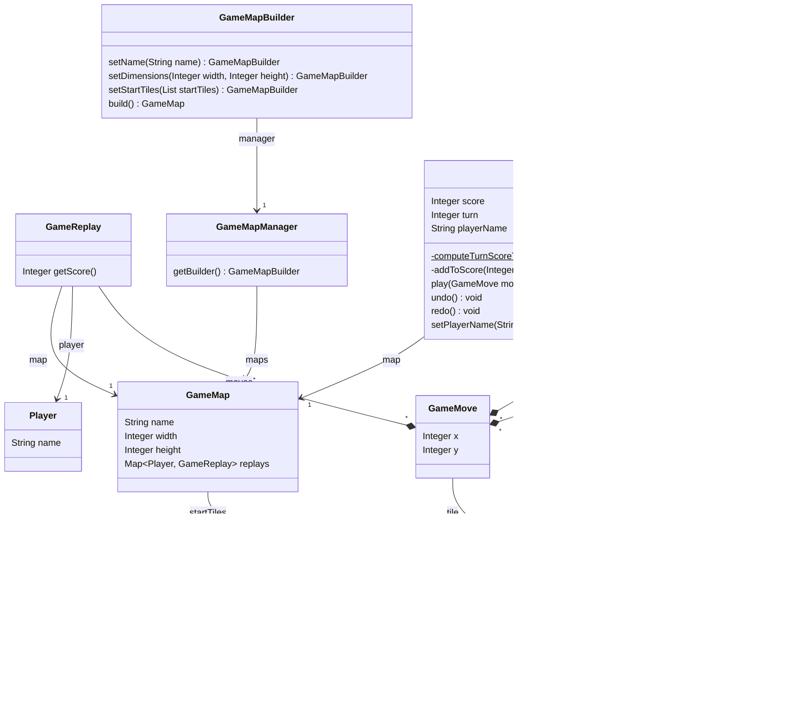

# Frontend model diagram

```mermaid
classDiagram
class Tile {
    <<interface>>
    String name
}

Tile <|-- NatureTile
class NatureTile {
    <<enumeration>>
    GRASS
    TREE
    WATER
}

Tile <|-- CityTile
class CityTile {
    <<enumeration>>
    CIRCUS
    FOUNTAIN
    HOUSE
    WINDMILL
    Integer points
    Integer neighbourPointsRadius
    getNeighbourPointsFor(Tile tile) Integer
}

class Player {
    String name
}

class GameMap {
    String name
    Integer width
    Integer height
    Map~Player, GameReplay~ replays
}
GameMap --> "*" NatureTile: startTiles

class GameReplay {
    Integer getScore()
}
GameReplay --> "1" GameMap: map
GameReplay --> "1" Player: player
GameReplay --* "*" GameMove: moves

class GameMove {
    Integer x
    Integer y
}
GameMove --> "1" CityTile: tile

class GameMapBuilder {
    setName(String name) GameMapBuilder
    setDimensions(Integer width, Integer height) GameMapBuilder
    setStartTiles(List<NatureTile> startTiles) GameMapBuilder
    build() GameMap
}
GameMapBuilder --> "1" GameMapManager: manager

class GameMapManager {
    getBuilder() GameMapBuilder
}
GameMapManager --> "*" GameMap: maps

class GameInventory {
    Map~CityTile, Integer~ tiles
}

class Game {
    Integer score
    Integer turn
    String playerName
    -computeTurnScoreThreshold(Integer turn)$ Integer
    -addToScore(Integer points) void
    play(GameMove move) void
    undo() void
    redo() void
    setPlayerName(String name) void
}
Game --> "1" GameMap: map
Game --* "1" GameInventory: inventory
Game --* "*" GameMove: moves
Game --* "*" GameMove: redoMoves
Game --> "*" Tile: currentTiles
```
